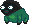

# Criminal Toad

<!-- AUTOGEN:START (regenerated from game source; edits inside this block are overwritten on the next run) -->
{ .item-icon }

| Property | Value |
|---|---|
| Grade | Striking |
| Equip slot | Waist |
| Max stack | 1 |
| Added in version | 0.0.0 |
| Save id | `criminaltoad` |

**In-game description:** Breaking objects gives you 5 xp
<!-- AUTOGEN:END -->

## Strategy & Notes

_Community-maintained: add tips, synergies, build ideas, and lore here._
