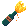

# Fire Bottle

<!-- AUTOGEN:START — regenerated from game source; edits inside this block are overwritten on the next run -->
{ .item-icon }

| Property | Value |
|---|---|
| Grade | Chaos |
| Equip slot | Hands |
| Price | 100 gold |
| Max stack | 1 |
| Quest item | No |
| Save id | `firebottle` |

**In-game description:** When damage is taken, there is a 15% to ignite everything within a 3 meter radius
<!-- AUTOGEN:END -->

## Strategy & Notes

_Community-maintained — add tips, synergies, build ideas, and lore here._
