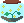

# Glowbug Terrarium

<!-- AUTOGEN:START (regenerated from game source; edits inside this block are overwritten on the next run) -->
{ .item-icon }

| Property | Value |
|---|---|
| Grade | Remarkable |
| Equip slot | Hands |
| Price | 100 gold |
| Max stack | 1 |
| Quest item | No |
| Save id | `glowbugterrarium` |

**In-game description:** Punching deals 2 damage in a 3 meter radius
<!-- AUTOGEN:END -->

## Strategy & Notes

_Community-maintained: add tips, synergies, build ideas, and lore here._
