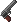
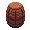

<!-- AUTOGEN:START (regenerated from game source; edits inside this block are overwritten on the next run) -->
# Items

All 99 items in *Bring Me Hope*. Click a column header to sort, or click an item name for its full page.

| Icon | Name | Grade | Slot | Price | Description |
|---|---|---|---|---:|---|
| { .item-icon-sm } | [Arousing Perfume](arousingperfume.md) | Ordinary | Waist | 100 | Has a 5% chance per second to love-stun enemies within a 4 meter radius |
| { .item-icon-sm } | [Battery (Negative) - Crystal Subway](key_battery_negative_crystalsubway.md) | Key | N/A | 0 | One of the two batteries used for backup power in the Crystal Subway. |
| { .item-icon-sm } | [Battery (Positive) - Crystal Subway](key_battery_positive_crystalsubway.md) | Key | N/A | 0 | One of the two batteries used for backup power in the Crystal Subway. |
| { .item-icon-sm } | [Blaow's Backpack - Frosted Caves](key_blaowsbackpack_frostedcaves.md) | Key | N/A | 0 | Blaow's backpack that his father (Daryl) packed for him. |
| { .item-icon-sm } | [Blood Drinker](blooddrinker.md) | Chaos | Waist | 750 | Dash speed is increased by 30% and physical damage is increased by 40%. Each dash and punch costs 0.5 health. |
| { .item-icon-sm } | [Bobbys Tools - Sea Cave City](key_bobbystools_seacavecity.md) | Key | N/A | 0 | Bobbys tools that he needed to fix his "Gamer Rig". |
| { .item-icon-sm } | [Bomb](key_bomb.md) | Key | N/A | 0 | Bombs that can be used to clear the debris blocking the north of the Gub Gub Caves. |
| { .item-icon-sm } | [Bongos](key_bongos.md) | Key | N/A | 0 | Bongo drums that were left behind by Guy. |
| { .item-icon-sm } | [Breathing Mask](breathingmask.md) | Striking | Head | 100 | Immunity to poison |
| { .item-icon-sm } | [Cell Phone](key_cellphone.md) | Key | N/A | 0 | A small phone that can be used for remote communication. |
| { .item-icon-sm } | [Cooking Pot](cookingpot.md) | Ordinary | Head | 100 | Increases physical resistance by 6.5% |
| { .item-icon-sm } | [Cracker](cracker.md) | Ordinary | Chest | 100 | Consuming this item will heal you for 50 health |
| { .item-icon-sm } | [Criminal Toad](criminaltoad.md) | Striking | Waist | 100 | Breaking objects gives you 5 xp |
| { .item-icon-sm } | [Critical Blade](criticalblade.md) | Exotic | Hands | 100 | Your physical attacks have a 20% chance to critical strike |
| { .item-icon-sm } | [Crown of Hope](crownofhope.md) | Exotic | Head | 1000 | Each enemy you kill permanently increases your physical damage for the rest of the run |
| { .item-icon-sm } | [Dash Spring](dashspring.md) | Striking | Feet | 100 | Increases kick off speed bonus by 10% |
| { .item-icon-sm } | [Dungeon Key - Frosted Caves](key_dungeonkey_frostedcaves.md) | Key | N/A | 0 | Unlocks doors within the Frosted Caves |
| { .item-icon-sm } | [Electric Jug](electricjug.md) | Striking | Waist | 100 | Every 5th punch deals 15 electric damage that can chain between enemies |
| { .item-icon-sm } | [Entrance Key - Crystal Subway](key_entrancekey_crystalsubway.md) | Key | N/A | 0 | Opens the locked gate leading into the Crystal Subway. |
| { .item-icon-sm } | [Executioner's Axe](executionersaxe.md) | Exotic | Chest | 1000 | Instantly defeats non-boss enemies you hit below 15% health. Does not stack with additional Executioner's Axes. |
| { .item-icon-sm } | [Exploding Gem](explodinggem.md) | Remarkable | Hands | 100 | Punching enemies creates an explosion that does 4 damage |
| { .item-icon-sm } | [Faulty Camera](faultycamera.md) | Ordinary | Hands | 100 | 3% chance per punch that enemies in a 4 meter radius get stunned for 2 seconds |
| { .item-icon-sm } | [Fern Charm](ferncharm.md) | Exceptional | Chest | 750 | Whenever you deal damage, regain 0.5 health |
| { .item-icon-sm } | [Fire Bottle](firebottle.md) | Chaos | Hands | 100 | When damage is taken, there is a 15% to ignite everything within a 3 meter radius |
| { .item-icon-sm } | [Fire Crystal](firecrystal.md) | Striking | Waist | 750 | Has a 10% chance per second to ignite enemies within a 4 meter radius |
| { .item-icon-sm } | [Fire Engine](fireengine.md) | Chaos | Chest | 100 | When on fire you get +20% physical/magical resistance and +40% physical damage |
| { .item-icon-sm } | [Fire Mask](firemask.md) | Striking | Head | 100 | Immunity to burning |
| { .item-icon-sm } | [Fishing Rod](key_fishingrod.md) | Key | N/A | 0 | A fishing rod you were given by a random sailor. Can be used to fish in some bodies of water. |
| { .item-icon-sm } | [Floating Feather](floatingfeather.md) | Remarkable | Feet | 500 | Increases your movement speed by 8% and your dodge chance by 10% |
| { .item-icon-sm } | [Foot Flipper](footflipper.md) | Ordinary | Feet | 100 | When wet, increases movement speed by 15% |
| { .item-icon-sm } | [Frog Skin](frogskin.md) | Exceptional | Chest | 100 | When wet you get 20% physical and magical resistance |
| { .item-icon-sm } | [Game Girl](gamegirl.md) | Remarkable | Hands | 100 | Increases damage by 20% |
| { .item-icon-sm } | [Gillian - Blue Rock](key_gillian_bluerock.md) | Key | N/A | 0 | A blue rock that was supposedly stolen. |
| { .item-icon-sm } | [Gillian - Cat Painting](key_gillian_catpainting.md) | Key | N/A | 0 | A cat painting that was supposedly stolen. |
| { .item-icon-sm } | [Gillian - Receipt](key_gillian_receipt.md) | Key | N/A | 0 | A potentially inaccurate receipt. |
| { .item-icon-sm } | [Glass Cannon Charm](glasscannoncharm.md) | Exotic | Hands | 1000 | Increases your base damage by 40%, but reduces your max health by 25% |
| { .item-icon-sm } | [Glowbug Terrarium](glowbugterrarium.md) | Remarkable | Hands | 100 | Punching deals 2 damage in a 3 meter radius |
| { .item-icon-sm } | [Glutton's Heart](gluttonsheart.md) | Striking | Chest | 750 | Whenever you are healed, gain +20% base damage for 10 seconds. |
| { .item-icon-sm } | [Green Juice](greenjuice.md) | Striking | Chest | 100 | Consuming this item will heal you for 150 health |
| { .item-icon-sm } | [Gub Gub Colossus Key - Sand City](key_gubgubcolossuskey_sandcity.md) | Key | N/A | 0 | Unlock the house in Sand City that leads to the Gub Gub Colossus. |
| { .item-icon-sm } | [Headhunter's Hat](headhuntershat.md) | Exotic | Head | 1000 | Permanently gain +0.1 max health for every enemy you defeat. There is no limit. |
| { .item-icon-sm } | [Heart Jar](heartjar.md) | Striking | Waist | 100 | Increases max health by 30 |
| { .item-icon-sm } | [Heroes Emerald](heroesemerald.md) | Remarkable | Chest | 100 | Performing a parry against a boss will inflict them with 20 magic damage |
| { .item-icon-sm } | [Heroes Ruby](heroesruby.md) | Remarkable | Chest | 100 | Life steal 2.5 health when you punch a boss |
| { .item-icon-sm } | [Heroes Sapphire](heroessapphire.md) | Remarkable | Chest | 100 | While fighting a boss increase magical resistance by 30% |
| { .item-icon-sm } | [Heroes Topaz](heroestopaz.md) | Remarkable | Chest | 100 | While fighting a boss increase physical resistance by 30% |
| { .item-icon-sm } | [Holey Shoe](holeyshoe.md) | Remarkable | Feet | 100 | Immunity to wetness and +5% physical resistance |
| { .item-icon-sm } | [Ice Crystal](icecrystal.md) | Striking | Waist | 750 | Has a 10% chance per second to freeze enemies within a 4 meter radius |
| { .item-icon-sm } | [Inflatable Raft](key_inflatableraft.md) | Key | N/A | 0 | An inflatable raft that can be used to ride along streams of flowing water. |
| { .item-icon-sm } | [Iron Helm](ironhelm.md) | Exceptional | Head | 750 | Increases physical resistance by 25% |
| { .item-icon-sm } | [Iron Undies](ironundies.md) | Exceptional | Waist | 750 | Increases physical resistance by 25% |
| { .item-icon-sm } | [Knight's Shoulder Armor Pad](knightsshoulderarmorpad.md) | Striking | Chest | 100 | Increases physical resistance by 15% |
| { .item-icon-sm } | [Knitted Mitten](knittedmitten.md) | Ordinary | Hands | 100 | Immunity to freezing |
| { .item-icon-sm } | [Krill's Seashell](krillsseashell.md) | Striking | Waist | 100 | Has a 20% chance per second to inflict enemies with leak, within a 4 meter radius |
| { .item-icon-sm } | [Krill's Seashells](key_krillsseashells.md) | Key | N/A | 0 |  |
| { .item-icon-sm } | [Lens Enhancer](lensenhancer.md) | Ordinary | Waist | 100 | Increases magical damage by 15% |
| { .item-icon-sm } | [Life Borrower](lifeborrower.md) | Striking | Chest | 100 | Parrying an enemy steals 2 health |
| { .item-icon-sm } | [Life Stealer](lifestealer.md) | Remarkable | Hands | 750 | Punching an enemy steals 0.5 health |
| { .item-icon-sm } | [Lockbox Key - Crystal Subway](key_lockboxkey_crystalsubway.md) | Key | N/A | 0 | Opens the engineers lockbox that was left behind in the Crystal Subway. |
| { .item-icon-sm } | [Loot Ring](lootring.md) | Ordinary | Hands | 100 | 10% chance to increase the rarity of items found in chests |
| { .item-icon-sm } | [Lost Texts](key_losttexts.md) | Key | N/A | 0 | A collection of lost texts describing something other worldy. |
| { .item-icon-sm } | [Matrix Accelerator](matrixaccelerator.md) | Remarkable | Chest | 100 | Increases dash speed by 30% |
| { .item-icon-sm } | [Mender's Locket](menderslocket.md) | Striking | Chest | 750 | Increases all healing you receive by 10% |
| { .item-icon-sm } | [Mirror Shard](mirrorshard.md) | Chaos | Chest | 1000 | Reflects 30% of the damage you take back to the attacker, but you take 15% more damage |
| { .item-icon-sm } | [Nature's Anklet](naturesanklet.md) | Striking | Feet | 100 | When damage is taken, there is a 40% chance that you'll regenerate 1.5 health |
| { .item-icon-sm } | [Orb of Absorption](orbofabsorption.md) | Chaos | Feet | 750 | Removes fluids from the ground within a 3 meter radius |
| { .item-icon-sm } | [Parry Dagger](parrydagger.md) | Exceptional | Hands | 100 | Parrying attacks gives you +40% physical damage for 4 seconds |
| { .item-icon-sm } | [Phantom Sock](phantomsock.md) | Exceptional | Feet | 1000 | Dashing makes you intangible for 0.2 seconds, ignoring all damage. Does not stack with additional Phantom Socks. |
| { .item-icon-sm } | [Plastic Sword](plasticsword.md) | Striking | Hands | 100 | +15% physical damage and taking damage has a 5% chance to trigger an auto-parry |
| { .item-icon-sm } | [Precision Visor](precisionvisor.md) | Remarkable | Head | 100 | Your physical attacks have a 10% chance to critical strike |
| { .item-icon-sm } | [Rat Hat](rathat.md) | Exceptional | Head | 100 | When you take damage, there is a 15% chance that you will auto-parry |
| { .item-icon-sm } | [Rat Heart](ratheart.md) | Remarkable | Chest | 100 | When poisoned you get +3 health regeneration |
| { .item-icon-sm } | [Reverse Time Watch](reversetimewatch.md) | Exotic | Waist | 2000 | When you die you are revived with full health but this item disappears |
| { .item-icon-sm } | [Running Shoe](runningshoe.md) | Striking | Feet | 100 | Increases movement speed by 5% |
| { .item-icon-sm } | [Rusted House Key](key_rustedhousekey.md) | Key | N/A | 0 | A rusted key that likely goes with a rusty lock somehwere. |
| { .item-icon-sm } | [Scholar's Circlet](scholarscirclet.md) | Striking | Head | 500 | Increases all XP you gain by 20% |
| { .item-icon-sm } | [Shellsea's Glowstick - Abandoned Town](key_shellseas_glowstick.md) | Key | N/A | 0 | Shellsea's glowstick that she lended you for the abandoned town. |
| { .item-icon-sm } | [Shock Collar](shockcollar.md) | Ordinary | Head | 1000 | When you take damage, there is a 10% chance that you will deal 5 electric damage in a 3 meter radius |
| { .item-icon-sm } | [Single Guy Sandal](singleguysandal.md) | Remarkable | Feet | 100 | Increases magical damage by 50% |
| { .item-icon-sm } | [Single Shot Revolver](singleshotrevolver.md) | Chaos | Hands | 100 | The gun has 6 rounds, 5 of them deal 15 physical damage to enemies, 1 of them deals 15 physical damage to you |
| { .item-icon-sm } | [Slicked Boot](slickedboot.md) | Ordinary | Feet | 100 | When dashing, oil will be placed on the ground beneath you |
| { .item-icon-sm } | [Slippery Fish](slipperyfish.md) | Ordinary | Waist | 100 | Increases dodge chance by 2.5% |
| { .item-icon-sm } | [Soft Toed Boot](softtoedboot.md) | Remarkable | Feet | 750 | Prevents damage to crabs and increases physical resistance by 35% |
| { .item-icon-sm } | [Soldering Iron](solderingiron.md) | Striking | Hands | 100 | Your punches have a 8% to ignite and deal 5 magic damage to enemies |
| { .item-icon-sm } | [Soul Jar Trinket](souljartrinket.md) | Ordinary | Waist | 750 | Punches deal 1 magic damage |
| { .item-icon-sm } | [Soul Magnet](soulmagnet.md) | Ordinary | Waist | 750 | Increases punches snapping you to enemies by 15% |
| { .item-icon-sm } | [Soul Slasher](soulslasher.md) | Striking | Hands | 100 | Punching inflicts enemies with leak for 3 seconds |
| { .item-icon-sm } | [Speed Trial Ticket](key_speedtrialticket.md) | Key | N/A | 0 | A ticket rewarded for completing a speed trial. |
| { .item-icon-sm } | [Sticky Donut](stickydonut.md) | Striking | Hands | 100 | Punches make enemies gooey (slowed by 25%) for 2 seconds |
| { .item-icon-sm } | [Stinky Sewer Key - Crystal Subway](key_stinkysewerkey_crystalsubway.md) | Key | N/A | 0 | Unlocks a door somewhere in the sewers of the Crystal Subway |
| { .item-icon-sm } | [Super Barrel](superbarrel.md) | Ordinary | Waist | 100 | While dashing there is a 10% chance a barrel with either water, oil, or poison will be thrown into the air. The barrel inflicts 2 physical damage. |
| { .item-icon-sm } | [Suplex Belt](suplexbelt.md) | Remarkable | Waist | 750 | Throwing a grabbed enemy slams them down, dealing 3 physical damage and stunning enemies within a 3 meter radius |
| { .item-icon-sm } | [Sympathy Gauntlet](sympathygauntlet.md) | Chaos | Hands | 750 | Increases physical damage by 75% and you take 10 physical damage whenever you punch enemies |
| { .item-icon-sm } | [Thorn Greave](thorngreave.md) | Exotic | Feet | 1000 | Dashing through enemies deals 1.5 physical damage and inflicts blood for 2 seconds, once per enemy per dash |
| { .item-icon-sm } | [Two-Faced Mask](twofacedmask.md) | Chaos | Head | 750 | Increases all damage you deal by 25% but you also take 25% more damage |
| { .item-icon-sm } | [Vampire's Goblet](vampiregoblet.md) | Exotic | Chest | 1000 | Heals you for 10% of the damage you deal, but reduces your max health by 40% |
| { .item-icon-sm } | [Vulnerability Sceptor](vulnerabilitysceptor.md) | Remarkable | Hands | 100 | Reduces magical resistance of enemies by 25% within a 3 meter radius |
| { .item-icon-sm } | [Water Bubble](waterbubble.md) | Ordinary | Chest | 100 | When dashing, water will be placed on the ground beneath you |
| { .item-icon-sm } | [Wind Energizer](windenergizer.md) | Ordinary | Waist | 100 | Knockback distance for punches is increased by 25% |
<!-- AUTOGEN:END -->
