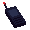

# Cell Phone

<!-- AUTOGEN:START — regenerated from game source; edits inside this block are overwritten on the next run -->
{ .item-icon }

| Property | Value |
|---|---|
| Grade | Key |
| Equip slot | — |
| Price | 0 gold |
| Max stack | 1 |
| Quest item | Yes |
| Save id | `key_cellphone` |

**In-game description:** A small phone that can be used for remote communication.
<!-- AUTOGEN:END -->

## Strategy & Notes

_Community-maintained — add tips, synergies, build ideas, and lore here._
