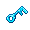

# Dungeon Key - Frosted Caves

<!-- AUTOGEN:START (regenerated from game source; edits inside this block are overwritten on the next run) -->
{ .item-icon }

| Property | Value |
|---|---|
| Grade | Key |
| Equip slot | N/A |
| Price | 0 gold |
| Max stack | 1 |
| Quest item | Yes |
| Save id | `key_dungeonkey_frostedcaves` |

**In-game description:** Unlocks doors within the Frosted Caves
<!-- AUTOGEN:END -->

## Strategy & Notes

_Community-maintained: add tips, synergies, build ideas, and lore here._
