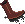

# Slicked Boot

<!-- AUTOGEN:START (regenerated from game source; edits inside this block are overwritten on the next run) -->
{ .item-icon }

| Property | Value |
|---|---|
| Grade | Ordinary |
| Equip slot | Feet |
| Max stack | 1 |
| Added in version | 0.0.0 |
| Save id | `slickedboot` |

**In-game description:** When dashing, oil will be placed on the ground beneath you
<!-- AUTOGEN:END -->

## Strategy & Notes

_Community-maintained: add tips, synergies, build ideas, and lore here._
