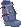

# Thorn Greave

<!-- AUTOGEN:START — regenerated from game source; edits inside this block are overwritten on the next run -->
{ .item-icon }

| Property | Value |
|---|---|
| Grade | Exotic |
| Equip slot | Feet |
| Price | 1000 gold |
| Max stack | 1 |
| Quest item | No |
| Save id | `thorngreave` |

**In-game description:** Dashing through enemies deals 1.5 physical damage and inflicts blood for 2 seconds, once per enemy per dash
<!-- AUTOGEN:END -->

## Strategy & Notes

_Community-maintained — add tips, synergies, build ideas, and lore here._
