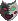

# Two-Faced Mask

<!-- AUTOGEN:START (regenerated from game source; edits inside this block are overwritten on the next run) -->
{ .item-icon }

| Property | Value |
|---|---|
| Grade | Chaos |
| Equip slot | Head |
| Price | 750 gold |
| Max stack | 1 |
| Quest item | No |
| Save id | `twofacedmask` |

**In-game description:** Increases all damage you deal by 25% but you also take 25% more damage
<!-- AUTOGEN:END -->

## Strategy & Notes

_Community-maintained: add tips, synergies, build ideas, and lore here._
