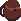
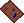
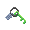
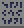

<!-- AUTOGEN:START (regenerated from game source; edits inside this block are overwritten on the next run) -->
# Key Items

Quest and key items used to progress. These are not part of the loot pool. 22 in total. Click a column header to sort, or click an item name for its full page.

| Icon | Name | Grade | Slot | Version | Description |
|---|---|---|---|---|---|
| { .item-icon-sm } | [Battery (Negative) - Crystal Subway](key_battery_negative_crystalsubway.md) | Key | N/A | 0.0.0 | One of the two batteries used for backup power in the Crystal Subway. |
| { .item-icon-sm } | [Battery (Positive) - Crystal Subway](key_battery_positive_crystalsubway.md) | Key | N/A | 0.0.0 | One of the two batteries used for backup power in the Crystal Subway. |
| { .item-icon-sm } | [Blaow's Backpack - Frosted Caves](key_blaowsbackpack_frostedcaves.md) | Key | N/A | 0.0.0 | Blaow's backpack that his father (Daryl) packed for him. |
| { .item-icon-sm } | [Bobbys Tools - Sea Cave City](key_bobbystools_seacavecity.md) | Key | N/A | 0.0.0 | Bobbys tools that he needed to fix his "Gamer Rig". |
| { .item-icon-sm } | [Bomb](key_bomb.md) | Key | N/A | 0.0.0 | Bombs that can be used to clear the debris blocking the north of the Gub Gub Caves. |
| { .item-icon-sm } | [Bongos](key_bongos.md) | Key | N/A | 0.0.0 | Bongo drums that were left behind by Guy. |
| { .item-icon-sm } | [Cell Phone](key_cellphone.md) | Key | N/A | 0.0.0 | A small phone that can be used for remote communication. |
| { .item-icon-sm } | [Dungeon Key - Frosted Caves](key_dungeonkey_frostedcaves.md) | Key | N/A | 0.0.0 | Unlocks doors within the Frosted Caves |
| { .item-icon-sm } | [Entrance Key - Crystal Subway](key_entrancekey_crystalsubway.md) | Key | N/A | 0.0.0 | Opens the locked gate leading into the Crystal Subway. |
| { .item-icon-sm } | [Fishing Rod](key_fishingrod.md) | Key | N/A | 0.0.0 | A fishing rod you were given by a random sailor. Can be used to fish in some bodies of water. |
| { .item-icon-sm } | [Gillian - Blue Rock](key_gillian_bluerock.md) | Key | N/A | 0.0.0 | A blue rock that was supposedly stolen. |
| { .item-icon-sm } | [Gillian - Cat Painting](key_gillian_catpainting.md) | Key | N/A | 0.0.0 | A cat painting that was supposedly stolen. |
| { .item-icon-sm } | [Gillian - Receipt](key_gillian_receipt.md) | Key | N/A | 0.0.0 | A potentially inaccurate receipt. |
| { .item-icon-sm } | [Gub Gub Colossus Key - Sand City](key_gubgubcolossuskey_sandcity.md) | Key | N/A | 0.0.0 | Unlock the house in Sand City that leads to the Gub Gub Colossus. |
| { .item-icon-sm } | [Inflatable Raft](key_inflatableraft.md) | Key | N/A | 0.0.0 | An inflatable raft that can be used to ride along streams of flowing water. |
| { .item-icon-sm } | [Krill's Seashells](key_krillsseashells.md) | Key | N/A | Unknown |  |
| { .item-icon-sm } | [Lockbox Key - Crystal Subway](key_lockboxkey_crystalsubway.md) | Key | N/A | 0.0.0 | Opens the engineers lockbox that was left behind in the Crystal Subway. |
| { .item-icon-sm } | [Lost Texts](key_losttexts.md) | Key | N/A | 0.0.0 | A collection of lost texts describing something other worldy. |
| { .item-icon-sm } | [Rusted House Key](key_rustedhousekey.md) | Key | N/A | 0.0.0 | A rusted key that likely goes with a rusty lock somehwere. |
| { .item-icon-sm } | [Shellsea's Glowstick - Abandoned Town](key_shellseas_glowstick.md) | Key | N/A | 0.0.0 | Shellsea's glowstick that she lended you for the abandoned town. |
| { .item-icon-sm } | [Speed Trial Ticket](key_speedtrialticket.md) | Key | N/A | 0.0.0 | A ticket rewarded for completing a speed trial. |
| { .item-icon-sm } | [Stinky Sewer Key - Crystal Subway](key_stinkysewerkey_crystalsubway.md) | Key | N/A | 0.0.0 | Unlocks a door somewhere in the sewers of the Crystal Subway |
<!-- AUTOGEN:END -->
