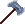

# Guppo's Axe

<!-- AUTOGEN:START (regenerated from game source; edits inside this block are overwritten on the next run) -->
{ .item-icon }

| Property | Value |
|---|---|
| Grade | Remarkable |
| Equip slot | Hands |
| Max stack | 1 |
| Added in version | 0.5.11 |
| Save id | `gupposaxe` |

**In-game description:** Your physical attacks have a 10% chance to freeze the enemy and deal 6 magic damage.

_Not found in the loot pool; obtained through other means._
<!-- AUTOGEN:END -->

## Strategy & Notes

_Community-maintained: add tips, synergies, build ideas, and lore here._
